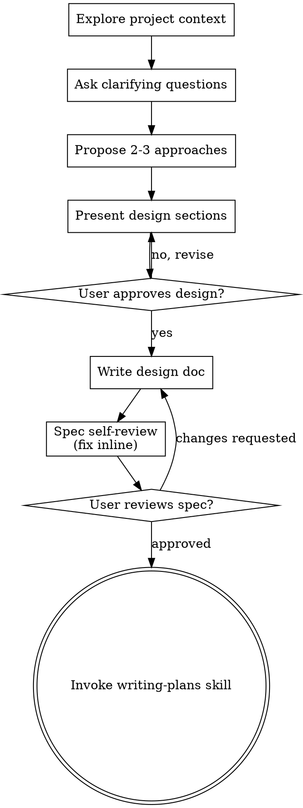

# 将创意转化为设计

通过自然的协作对话，将创意转化为完整的设计和规格说明。

首先了解当前项目的背景，然后逐一提出问题以完善创意。一旦明确了要构建的内容，就展示设计并获得用户批准。

<HARD-GATE>
在提交设计并获得用户批准之前，切勿运用任何实现技能、编写任何代码、搭建任何项目框架，或采取任何实现行动。无论项目看似多么简单，这一原则都适用于每一个项目。
</HARD-GATE>

## 反模式：“这太简单了，不需要设计”

每个项目都要经历这个过程。无论是待办事项列表、单功能工具，还是配置更改——无一例外。“简单”的项目往往正是未经审视的假设导致最多工作浪费的地方。设计可以很简短（对于真正简单的项目，几句话就够了），但你必须提交设计并获得批准。

## 检查清单

你必须针对以下每一项创建任务，并按顺序完成：

1. **探索项目背景** —— 检查文件、文档和最近的提交
2. **适时提供可视化辅助** —— 切勿提前提供。当首次出现“通过展示比文字描述更清晰”的情况时，立即提供（单独的消息）；获得批准后，相关浏览器标签页会自动为你打开。如果从未出现需要可视化辅助的情况，则永远不要提供。参见下文“可视化辅助”部分。
3. **提出澄清问题** —— 一次一个，弄清目的/约束条件/成功标准
4. **提出 2-3 种方案** —— 包括权衡利弊及您的建议
5. **展示设计** —— 按复杂程度分段展示，每完成一个部分后征得用户认可
6. **编写设计文档** —— 保存至 `docs/superpowers/specs/YYYY-MM-DD-<topic>-design.md` 并提交
7. **规格说明书自审** —— 快速内联检查占位符、矛盾、歧义及范围（见下文）
8. **用户审核书面规格说明** —— 在继续之前请用户审核规格说明文件
9. **过渡到实现阶段** —— 调用“编写计划”技能来制定实现计划

## 流程图

**最终状态是调用“编写计划”技能。** 切勿调用 frontend-design、mcp-builder 或任何其他实现技能。头脑风暴后唯一应调用的技能是 writing-plans。

## 流程

**理解构想：**

- 首先检查当前项目状态（文件、文档、最近的提交）
- 在提出详细问题之前，先评估范围：如果需求描述了多个独立的子系统（例如，“构建一个包含聊天、文件存储、计费和分析功能的平台”），请立即标注出来。不要在需要先进行分解的项目上花费时间去追问细节。
- 如果项目规模过大，无法用一份规格说明书涵盖，请协助用户将其分解为子项目：哪些是独立的组成部分？它们之间有何关联？应按什么顺序构建？然后通过常规的设计流程对第一个子项目进行头脑风暴。每个子项目都有其独立的规格说明书 → 计划 → 实施循环。
- 对于范围适中的项目，一次只提出一个问题以完善构想
- 尽可能采用多选题形式，但开放式问题也可行
- 每条消息仅提一个问题——若某个主题需要进一步探讨，请将其拆分为多个问题
- 专注于理解：目的、约束条件、成功标准

**探索方案：**

- 提出 2-3 种不同的方案及其权衡取舍
- 以对话形式呈现选项，并附上你的推荐方案及理由
- 首先提出你推荐的方案，并解释原因

**展示设计：**

- 一旦你确信自己理解了要构建的内容，就展示设计
- 根据各部分的复杂程度调整篇幅：简单部分用几句话说明，复杂部分可扩展至200-300字
- 每讲完一个部分，都询问对方目前理解是否正确
- 涵盖内容：架构、组件、数据流、错误处理、测试
- 若某处表述不清晰，需做好回溯澄清的准备

**以隔离和清晰为设计原则：**

- 将系统拆分为更小的单元，每个单元都应具有一个明确的目的，通过定义明确的接口进行通信，并且能够独立理解和测试
- 对于每个单元，你应该能够回答：它做什么、如何使用它，以及它依赖什么？
- 是否有人无需阅读其内部实现就能理解该单元的功能？是否可以在不影响使用者的情况下修改其内部实现？如果不能，则需要调整其边界。
- 更小、边界明确的单元也更便于你进行开发——当你能一次性把握代码上下文时，分析会更透彻；当文件内容聚焦时，你的修改也会更可靠。当一个文件变得庞大时，这通常意味着它承担了过多的职责。

**在现有代码库中工作：**

- 在提出更改建议前，先探索当前的结构。遵循现有的模式。
- 如果现有代码存在影响工作的缺陷（例如：文件过大、边界不清、职责混乱），请将有针对性的改进纳入设计中——这正是优秀开发者改进所处理代码的方式。
- 不要提出无关的重构建议。始终专注于服务于当前目标的内容。

## 设计完成后

**文档：**

- 将经过验证的设计（规格说明书）写入 `docs/superpowers/specs/YYYY-MM-DD-<topic>-design.md`
  - （用户对规格说明书位置的偏好设置将覆盖此默认值）
- 如条件允许，运用“元素风格：清晰简洁写作”技巧
- 将设计文档提交至 git

**规格说明书自审：**
撰写完规格说明书后，以全新的视角审视它：

1. **占位符检查：** 是否有“待定”（TBD）、“待办”（TODO）、不完整的章节或模糊的需求？予以修正。
2. **内部一致性：** 各章节之间是否存在矛盾？架构与功能描述是否一致？
3. **范围检查：** 该文档是否足够聚焦以支持单一实现计划，还是需要进行分解？
4. **歧义检查：** 是否有任何需求可能被解读为两种不同的含义？如果有，请选定一种并明确表述。

直接在文档中修正任何问题。无需重新审核——修正后即可继续。

**用户审核环节：**
在规格说明书审核循环通过后，请用户在继续之前审核已撰写的规格说明书：

> “规格说明书已编写并提交至 `<path>`。请审核并告知我，是否在我们开始编写实施计划前需要进行任何修改。”

等待用户的回复。如果用户要求修改，请进行修改并重新运行规格说明书审查循环。只有在用户批准后才能继续。

**实施：**

- 调用 writing-plans 技能来创建详细的实施方案
- 切勿调用任何其他技能。writing-plans 是下一步操作。

## 关键原则

- **一次只提一个问题** - 不要同时提出多个问题，以免让用户应接不暇
- **优先采用多选题** - 尽可能选择多选题，比开放式问题更容易回答
- **毫不留情地遵循 YAGNI 原则** - 从所有设计中剔除不必要的功能
- **探索替代方案** - 在确定方案前，始终提出 2-3 种方法
- **增量验证** - 展示设计方案，获得批准后再继续
- **保持灵活性** - 遇到不合理之处时，要回过头来澄清

## 可视化辅助工具

一款基于浏览器的辅助工具，用于在头脑风暴过程中展示原型、图表和视觉方案。它作为工具存在，而非固定模式。启用该辅助工具意味着它仅适用于那些能从视觉呈现中获益的问题；这并不意味着每个问题都必须通过浏览器进行。

**提供辅助工具（及时提供）：** 切勿在讨论伊始就提出。请等待直到某个问题确实通过展示比口头描述更清晰时——即涉及真实原型/布局/图表的问题，而非仅仅是 UI *话题*。当这种情况首次出现时，请以独立消息的形式提出：
> “接下来的部分如果我展示给您看可能会更容易理解——我可以在浏览器标签页中实时制作原型、图表和对比内容。这个功能还比较新，且可能消耗大量令牌。需要我操作吗？我会为您打开。”

**此提议必须作为独立消息发送。** 仅包含提议——不要附带任何澄清问题、总结或其他内容。等待用户的回复。如果用户接受，请使用 `--open` 启动服务器，以便其浏览器自动跳转到第一屏。如果用户拒绝，请继续仅使用文本交流，除非用户主动提出，否则不要再次提议。

**针对每个问题的决策：**即使用户已接受，也需针对每个问题分别决定是使用浏览器还是终端。判断标准是：**用户通过查看内容是否比阅读文字更能理解？**

- **使用浏览器** 展示具有视觉性的内容——设计稿、线框图、布局对比、架构图、并排展示的视觉设计
- **使用终端** 展示纯文本内容——需求问题、概念性选择、权衡列表、A/B/C/D文本选项、范围决策

关于 UI 主题的问题并不一定就是视觉问题。“在此语境下，‘个性’指什么？”是一个概念性问题——请使用终端。“哪种向导布局效果更好？”是一个视觉问题——请使用浏览器。

如果他们同意使用配套指南，请在继续操作前阅读详细指南：
`skills/brainstorming/visual-companion.md`
