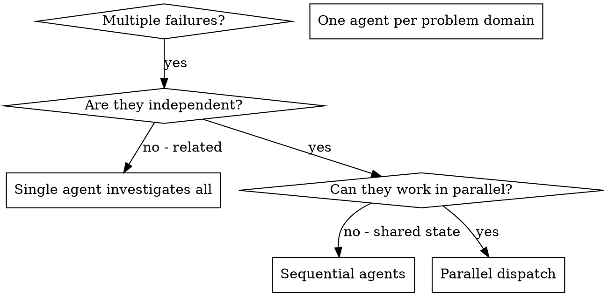

# 调度并行代理

## 概述

您将任务委托给具有隔离上下文的专用代理。通过精确设计其指令和上下文，您可以确保它们保持专注并成功完成任务。它们绝不应继承您会话的上下文或历史记录——您应仅构建它们所必需的内容。这同时也能保留您自己的上下文，以便进行协调工作。

当您遇到多个互不相关的故障（不同的测试文件、不同的子系统、不同的缺陷）时，依次排查会浪费时间。每次排查都是独立的，可以并行进行。

**核心原则：** 针对每个独立的问题域派遣一个代理。让它们并行工作。

## 何时使用



**适用场景：**
- 3 个及以上测试文件因不同根本原因失败
- 多个子系统独立出现故障
- 每个问题无需参考其他问题的上下文即可理解
- 调查之间没有共享状态

**不适用场景：**
- 故障之间存在关联 （修复其中一个可能导致其他问题随之解决）
- 需要了解整个系统的状态
- 代理之间会相互干扰

## 模式

### 1. 识别独立领域

根据故障类型对失败进行分组：
- 文件 A 测试：工具审批流程
- 文件 B 测试：批处理完成行为
- 文件 C 测试：中止功能

每个领域都是独立的——修复工具审批不会影响中止测试。

### 2. 创建聚焦的代理任务

每个代理负责：
- **特定范围：** 一个测试文件或子系统
- **明确目标：** 使这些测试通过
- **限制条件：** 不得修改其他代码
- **预期输出：** 发现的问题及修复情况的总结

### 3. 并行调度

在同一响应中发出所有三个子代理的调度指令——它们将并行运行：

```text
Subagent (general-purpose): "Fix agent-tool-abort.test.ts failures"
Subagent (general-purpose): "Fix batch-completion-behavior.test.ts failures"
Subagent (general-purpose): "Fix tool-approval-race-conditions.test.ts failures"
# All three run concurrently.
```

一个响应中包含多个调度调用 = 并行执行；每个响应仅包含一个 = 顺序执行。

### 4. 审查与整合

当代理返回时：
- 阅读每份总结
- 验证修复结果是否存在冲突
- 运行完整的测试套件
- 整合所有更改

## 代理提示结构

优秀的代理提示应具备以下特点：
1. **聚焦** — 仅针对一个明确的问题领域
2. **自包含** — 包含理解问题所需的所有上下文
3. **输出明确** — 代理应返回什么结果？

```markdown
Fix the 3 failing tests in src/agents/agent-tool-abort.test.ts:

1. "should abort tool with partial output capture" - expects 'interrupted at' in message
2. "should handle mixed completed and aborted tools" - fast tool aborted instead of completed
3. "should properly track pendingToolCount" - expects 3 results but gets 0

These are timing/race condition issues. Your task:

1. Read the test file and understand what each test verifies
2. Identify root cause - timing issues or actual bugs?
3. Fix by:
   - Replacing arbitrary timeouts with event-based waiting
   - Fixing bugs in abort implementation if found
   - Adjusting test expectations if testing changed behavior

Do NOT just increase timeouts - find the real issue.

Return: Summary of what you found and what you fixed.
```

## 常见错误

**❌ 范围过广：** “修复所有测试” —— 代理会不知所措
**✅ 具体明确：** “修复 agent-tool-abort.test.ts” —— 范围明确

**❌ 缺乏上下文：** “修复竞争条件” —— 代理无法确定具体位置
**✅ 提供上下文：** 粘贴错误信息和测试名称

**❌ 没有约束条件：** 代理可能会重构所有代码
**✅ 限制条件：** “请勿修改生产环境代码”或“仅修复测试”

**❌ 输出模糊：** “修复它” —— 无法得知具体修改了什么
**✅ 具体：** “返回根本原因及修改内容的摘要”

## 何时不应使用

**相关故障：** 修复其中一个可能会一并修复其他问题——应先共同排查
**需要完整上下文：** 理解问题需要查看整个系统
**探索性调试：** 你尚不清楚哪里出了问题
**共享状态：** 代理之间会相互干扰（编辑相同文件、使用相同资源）

## 实际会话中的真实案例

**场景：** 重大重构后，3 个文件中共有 6 个测试失败

**失败情况：**
- agent-tool-abort.test.ts：3 次失败（超时问题）
- batch-completion-behavior.test.ts：2 次失败（工具未执行）
- tool-approval-race-conditions.test.ts：1 次失败（执行次数 = 0）

**决策：** 独立领域——中止逻辑、批量完成逻辑与竞争条件逻辑相互分离

**分派：**
```
Agent 1 → Fix agent-tool-abort.test.ts
Agent 2 → Fix batch-completion-behavior.test.ts
Agent 3 → Fix tool-approval-race-conditions.test.ts
```

**结果：**
- 代理 1：将超时机制替换为基于事件的等待
- 代理 2：修复了事件结构错误 （threadId 位置错误）
- 代理 3：添加了等待异步工具执行完成的逻辑

**集成：** 所有修复均相互独立，无冲突，全套测试通过

**节省时间：** 并行解决 3 个问题，而非顺序处理

## 主要优势

1. **并行化** - 多项调查同时进行
2. **聚焦** - 每个代理的范围狭窄，需要跟踪的上下文更少
3. **独立性** - 代理之间互不干扰
4. **速度** - 1 个时间单位内解决了 3 个问题

## 验证

代理返回后：
1. **审查每份摘要** - 了解发生了哪些变化
2. **检查冲突** - 代理是否修改了相同的代码？
3. **运行完整测试套件** - 验证所有修复方案能否协同工作
4. **抽查** - 代理可能产生系统性错误

## 实际影响

来自调试会（2025-10-03）：
- 3 个文件中共有 6 处故障
- 并行调度了 3 个代理
- 所有排查工作同时完成
- 所有修复方案均成功合并
- 代理之间的修改零冲突
