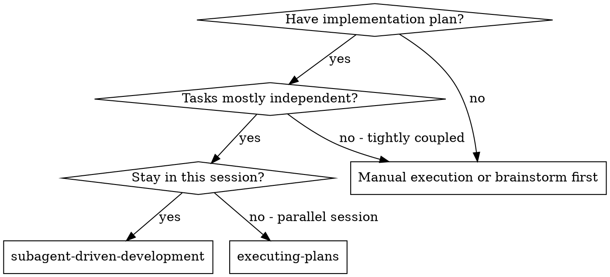
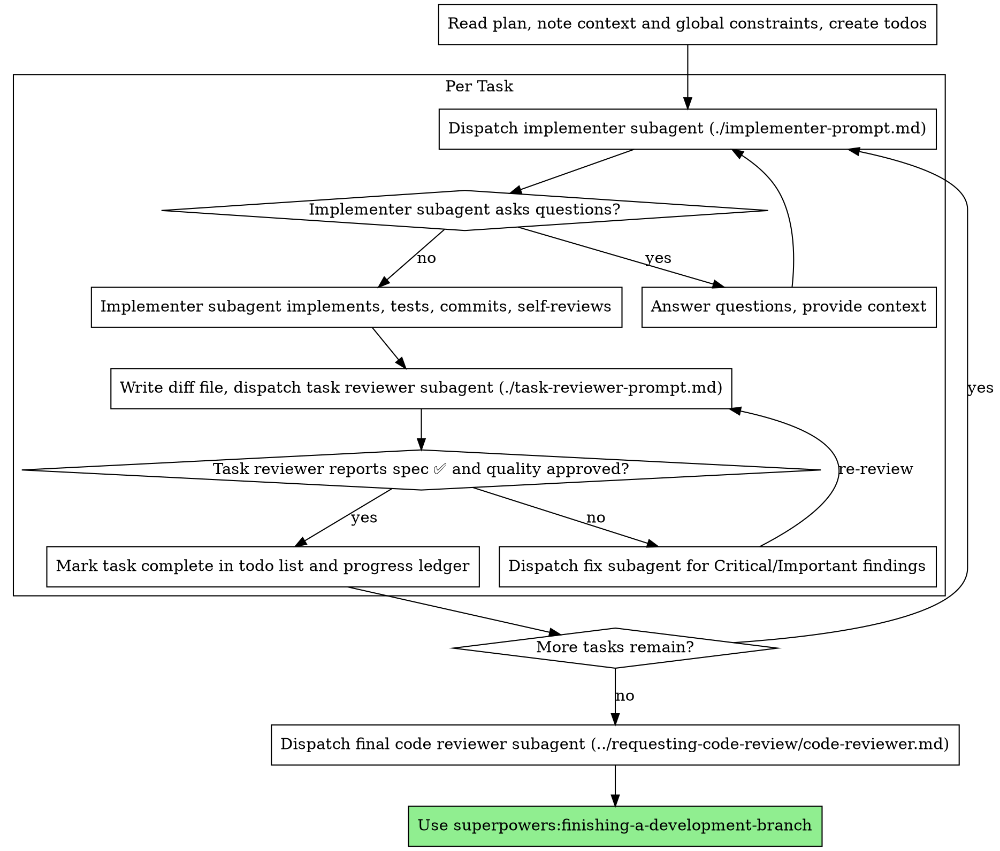

# 子代理驱动开发

通过为每个任务分派一个全新的实现子代理来执行计划，每个任务完成后进行任务审查（规范符合性 + 代码质量），最后对整个分支进行全面审查。

**为何采用子代理：** 您将任务委托给具有隔离上下文的专用代理。通过精确设计其指令和上下文，可确保它们保持专注并成功完成任务。它们绝不应继承您会话的上下文或历史记录——您只需构建它们所需的精确环境。这同时也能保留您自身的上下文，以便进行协调工作。

**核心原则：** 每项任务分配新的子代理 + 任务审查（规范 + 质量） + 全面的最终审查 = 高质量、快速迭代

**叙述：** 在调用工具之间，叙述内容最多仅限一行简短文字——
账本和工具结果将记录全部内容。

**连续执行：**任务之间不要暂停以向人类合作伙伴汇报。按计划不间断地执行所有任务。唯一可以停止的情况是：你无法解决的“阻塞”状态、真正阻碍进展的模糊性，或者所有任务已完成。 “是否继续？”之类的提示和进度摘要只会浪费他们的时间——既然他们要求你执行计划，那就照做。

## 何时使用



**与执行计划（并行会话）的对比：**
- 同一会话（无上下文切换）
- 每个任务使用新的子代理（无上下文污染）
- 每个任务完成后进行审查（规范符合性 + 代码质量），最后进行全面审查
- 迭代更快（任务之间无需人工干预）

## 流程



## 飞行前计划审查

在调度任务 1 之前，先对计划进行一次扫描以检查冲突：

- 相互矛盾或违反计划全局约束的任务
- 计划中明确要求但评审标准视为
  缺陷的任何内容（未进行任何断言的测试、逻辑块的逐字复制）

将发现的所有问题作为一批问题提交给人类合作伙伴——
将每个发现标注在计划文本中相应的强制要求旁，并询问哪一方具有优先权——
在执行开始前一次性提交，而不是在计划执行过程中每发现一个问题就中断一次。如果
扫描结果无误，则无需评论，直接继续。 审查循环仍是捕捉
仅在实现过程中才显现的冲突的防护网。

## 模型选择

使用能够处理每个角色的最弱模型，以节省成本并提高速度。

**机械性实现任务**（孤立函数、清晰规格说明、1-2 个文件）：使用快速、低成本的模型。 当计划定义明确时，大多数实现任务都是机械性的。

**集成与判断任务**（多文件协调、模式匹配、调试）：使用标准模型。

**架构与设计任务**：使用现有能力最强的模型。
最终的整个分支审查属于此类任务——应将其分配给
功能最强大的可用模型，而非会话默认模型。

**审查任务**：选择判断标准相同的模型，并根据
差异的大小、复杂度和风险进行调整。 一个微小的机械性差异无需使用
最强大的模型；而一个微妙的并发性变更则需要。

**调度子代理时，务必明确指定模型。**若
省略模型，系统将继承会话的模型——通常是最强大且
最昂贵的——这会悄无声息地违背本节规定。

**轮次数量比令牌价格更重要。** 实际耗时和上下文成本随
子代理所用的轮次数量而增加，而在多步骤工作中，最便宜的模型通常需要 2-3 倍的
轮次——总体成本更高。对于审阅者和根据自然语言描述进行实现的开发者，应将
中端模型作为最低标准。
当任务计划文本包含完整的待编写代码时，
实现过程仅需代码转录和测试：为该
实现者选用最便宜的层级。单文件机械性修复也应选用最便宜的层级。

**任务复杂度信号（实现任务）：**
- 仅涉及 1-2 个文件且有完整规格说明 → 低成本模型
- 涉及多个文件且存在集成问题 → 标准模型
- 需要设计判断或对代码库有广泛理解 → 最高能力模型

## 处理实现者状态

实现者子代理会报告四种状态之一。请针对每种状态采取相应处理：

**DONE：** 生成审查包（`scripts/review-package BASE HEAD`，来自该技能的目录——它会打印其写入的唯一文件路径； BASE 是你在派遣实施者之前记录的提交——绝不会是 `HEAD~1`，后者会无提示地丢弃多提交任务中除最后一个提交以外的所有提交），然后使用打印出的路径派遣任务审阅者。

**DONE_WITH_CONCERNS：** 实施者已完成工作但标记了疑虑。在继续之前请阅读这些疑虑。如果疑虑涉及正确性或范围，请在评审前予以解决。如果只是观察性意见（例如，“此文件体积过大”），请记录下来并继续进行评审。

**NEEDS_CONTEXT:** 实现者需要未提供的信息。请补充缺失的背景信息并重新分派任务。

**BLOCKED：** 实现者无法完成任务。评估阻碍因素：
1. 若是上下文问题，请提供更多上下文信息，并使用同一模型重新分派
2. 若任务需要更强的推理能力，请使用更强大的模型重新分派
3. 若任务规模过大，将其拆分为更小的部分
4. 若计划本身有误，请上报给人工处理

**切勿** 忽略上报或强行让同一模型在未作更改的情况下重试。如果实施者表示卡住了，就说明需要做出调整。

## 处理审阅者标记的 ⚠️ 项

任务审阅者可能会报告“⚠️ 无法通过差异比较验证”的项目——这些需求
存在于未更改的代码中，或跨越多个任务。这些项目不会阻碍后续
的审阅流程，但你必须在将任务标记为
标记为完成前，必须自行解决每个问题：你掌握着评审员
所缺乏的计划和跨任务背景。如果你确认某项确实存在缺失，请将其视为规格说明
评审失败——将其退回给实现者并重新评审。

## 编写评审提示

按任务进行的评审属于任务范围内的门控检查。全面评审仅在
最终的全分支评审阶段进行一次。填写评审模板时：

- 除非有具体且针对该任务的理由，否则不要添加“检查所有用法”或“如有必要请运行竞态条件测试”
  等开放式指令
- 不要要求评审者重新运行实现者已在
  同一代码上运行过的测试——实现者的报告中已包含测试证据
- 不要为评审员预先判定发现结果——切勿指示评审员
  忽略或不标记特定问题。如果您认为某项发现属于
  误报，请让评审员在评审过程中提出并裁定该问题
  循环中进行裁决。如果你撰写的提示中包含“不要标记”、“不要将 X
  视为缺陷”、“至多为轻微”或“计划选择了”——请立即停止：你正在
  预先判断，通常是为了省去一次审查循环。
- 你交给审阅者的全局约束块就是其关注的
  聚焦点。请逐字复制计划中“全局
  约束”部分或规格说明书中的约束要求：精确数值、精确格式，以及
  组件之间明确的关系（“与 X 布局相同”， “与
  Y匹配”）。审阅者的模板中已包含流程规则（YAGNI、
  测试规范、审阅方法）——约束块专用于满足本
  项目规格书的要求。
- 将该技能生成的 diff 作为文件提供给审阅者：运行该技能的
  `scripts/review-package BASE HEAD`，并将它输出的文件路径
  传递给审阅者（或者，若不使用bash：`git log --oneline`、`git diff --stat`
  和`git diff -U10`用于处理该范围，重定向到一个唯一命名的
  文件）。 输出绝不会进入你自己的上下文，评审者可通过一次 Read
  调用查看提交列表、统计摘要以及包含上下文的完整差异。请使用在分派实施者之前记录的 BASE ——
  切勿使用 `HEAD~1`，该命令会无提示地截断多提交任务。
- 分派提示应描述单个任务，而非会话历史。请勿
  将累积的先前任务摘要（如“任务 1-3 后的状态”）
  粘贴到后续分派中——某真实会话的分派内容曾达到 42k 个字符，其中 99%
  均为粘贴的历史记录。 一个新创建的子代理只需其任务、所涉及的
  接口以及全局约束条件。除此之外，无需其他内容。
- 针对“关键”和“重要”级别的发现，由调度器指派子代理进行修复。将“次要”
  级别的发现实时记录在进度日志中，并在最终
  全分支审查时将重点放在该列表上，以便筛选出哪些问题必须在
  合并前修复。一份无人阅读的汇总报告等同于被默默弃置。
- 标记为“计划强制”的发现项——或任何与
  计划文本要求相冲突的发现项——应由人类做出决定，如同处理任何计划
  矛盾一样：呈现该发现项及计划文本，询问以哪一方为准。
  不要因为计划有此要求就忽略该发现，也不要
  未经询问就提交与计划相矛盾的修复方案。
- 最终的全分支审查也会收到一个包：运行
  `scripts/review-package MERGE_BASE HEAD`（MERGE_BASE = 该
  分支的起始提交，例如 `git merge-base main HEAD`），并将
  生成的路径包含在最终审查分发中，以便最终审查者直接阅读
  一个文件，而非通过 git 命令重新推导分支差异。
- 每次修复提交都应包含实现者契约：修复子代理
  需重新运行覆盖其变更的测试并报告结果。在提交中列出
  覆盖测试的文件名——如果仅是一行代码的修复，则无需
  提供整个测试套件。 在向审阅者重新分发之前，请确认修复报告
  包含覆盖测试、执行的命令以及输出结果；只有当这三项均已齐备时，才分发
  重新审阅请求。
- 如果最终的全分支审查发现问题，请分发一个修复
  子代理并附上完整的发现列表——而不是每个发现都分配一个修复器。
  按发现分配的修复器会各自重建上下文并重新运行测试套件；在实际
  会话中，最终审查的修复波所耗费的资源甚至超过了所有任务的总和。

## 文件交接

您粘贴到调度提示符中的所有内容——以及子代理
打印回来的所有内容——在会话剩余时间内
都会保留在您的上下文中，并在后续的每个回合中被重新读取。请以文件形式移交工件：

- **任务简报：**在派遣实现者之前，运行该技能的
  `scripts/task-brief PLAN_FILE N`——它会将任务的完整文本提取到一个
  具有唯一名称的文件中，并打印出路径。编写派遣指令时，确保
  该简报始终是需求说明的唯一来源。 您的派遣指令应
  包含：(1) 一行说明该任务在项目中的定位；(2)
  任务简报的路径，并注明“请先阅读此文件——这是您的需求，
  其中包含需原样使用的精确数值”； (3) 简报中无法包含的、
  来自先前任务的接口和决策；(4) 你对
  简报中发现的任何歧义所做的澄清；(5) 报告文件的路径和
  报告规范。确切值（数字、魔数、签名、测试
  用例）仅出现在简报中。
- **报告文件：**将实现者的报告文件命名为简报的后缀
  （简报 `…/task-N-brief.md` → 报告 `…/task-N-report.md`），并将其放入
  调度提示中。 实现者需在此处编写完整报告，
  并仅返回状态、提交内容、一行测试摘要以及关注事项。
- **评审者输入：**任务评审者将获得三个路径——相同的任务说明
  文件、报告文件以及评审包——外加约束该任务的
  全局约束条件。
- 修复调度会将其修复报告（含测试结果）追加到同一
  报告文件中，并返回简短摘要；重新评审将读取更新后的文件。

## 持久化进度

对话记忆无法在压缩后保留。在实际会话中，
丢失位置的控制器曾重新分派整个已完成的任务
序列——这是观察到的最耗资源的故障。应在
账本文件中跟踪进度，而不仅仅是在待办事项中。

- 技能启动时，检查是否存在分类账：
  `cat "$(git rev-parse --show-toplevel)/.superpowers/sdd/progress.md"`。其中列为
  “已完成”的任务即为 DONE —— 不要重新分派它们；从第一个
  未标记为“已完成”的任务处继续。
- 当任务审核通过后，在
  与其他记录相同的消息中向分类账追加一行：
  `Task N: complete (commits <base7>..<head7>, review clean)`。
- 分类账是你的恢复地图：其中列出的提交即使
  在你的上下文环境已不记得创建它们时，也依然存在于 Git 中。 压缩完成后，
  请相信分类账和 `git log`，而非你自己的记忆。
- `git clean -fdx` 将销毁分类账（它是被 git 忽略的临时文件）；如果
  发生这种情况，请从 `git log` 恢复。

## 提示模板

- [implementer-prompt.md](implementer-prompt.md) - 调度实现者子代理
- [task-reviewer-prompt.md](task-reviewer-prompt.md) - 调度任务审阅者子代理 （规范符合性 + 代码质量）
- 最终全分支审查：使用 superpowers:requesting-code-review 的 [code-reviewer.md](../requesting-code-review/code-reviewer.md)

## 工作流示例

```
You: I'm using Subagent-Driven Development to execute this plan.

[Read plan file once: docs/superpowers/plans/feature-plan.md]
[Create todos for all tasks]

Task 1: Hook installation script

[Run task-brief for Task 1; dispatch implementer with brief + report paths + context]

Implementer: "Before I begin - should the hook be installed at user or system level?"

You: "User level (~/.config/superpowers/hooks/)"

Implementer: "Got it. Implementing now..."
[Later] Implementer:
  - Implemented install-hook command
  - Added tests, 5/5 passing
  - Self-review: Found I missed --force flag, added it
  - Committed

[Run review-package, dispatch task reviewer with the printed path]
Task reviewer: Spec ✅ - all requirements met, nothing extra.
  Strengths: Good test coverage, clean. Issues: None. Task quality: Approved.

[Mark Task 1 complete]

Task 2: Recovery modes

[Run task-brief for Task 2; dispatch implementer with brief + report paths + context]

Implementer: [No questions, proceeds]
Implementer:
  - Added verify/repair modes
  - 8/8 tests passing
  - Self-review: All good
  - Committed

[Run review-package, dispatch task reviewer with the printed path]
Task reviewer: Spec ❌:
  - Missing: Progress reporting (spec says "report every 100 items")
  - Extra: Added --json flag (not requested)
  Issues (Important): Magic number (100)

[Dispatch fix subagent with all findings]
Fixer: Removed --json flag, added progress reporting, extracted PROGRESS_INTERVAL constant

[Task reviewer reviews again]
Task reviewer: Spec ✅. Task quality: Approved.

[Mark Task 2 complete]

...

[After all tasks]
[Dispatch final code-reviewer]
Final reviewer: All requirements met, ready to merge

Done!
```

## 优势

**与手动执行相比：**
- 子代理自然遵循 TDD
- 每个任务都有全新的上下文 （不会产生混淆）
- 支持并行处理（子代理之间互不干扰）
- 子代理可提出问题（工作开始前及进行中均可）

**与执行计划相比：**
- 同一会话（无需交接）
- 持续推进（无需等待）
- 审查检查点自动生成

**效率提升：**
- 控制器精确筛选所需上下文；批量工件以
  文件形式传输，而非粘贴的文本
- 子代理在开始前即可获得完整信息
- 问题在工作开始前（而非之后）被提出

**质量门：**
- 自检可在交接前发现问题
- 任务审查包含两项判定：符合规范与代码质量
- 审查循环确保修复措施切实有效
- 符合规范可防止构建过剩或不足
- 代码质量确保实现质量优良

**成本：**
- 子代理调用次数增加（每个任务需实施者 + 审查者）
- 控制器需进行更多准备工作 （需提前提取所有任务）
- 审查循环增加了迭代次数
- 但能及早发现问题（比后期调试更经济）

## 红旗警示

**切勿：**
- 未经用户明确同意，在 main/master 分支上开始实现
- 跳过任务审查，或接受缺少任一审查结果的报告 （必须同时满足规范符合性与任务质量要求）
- 在问题未解决的情况下继续推进
- 并行调度多个实现子代理（会导致冲突）
- 让子代理读取整个计划文件（应直接提供其任务概要——
  `scripts/task-brief`）
- 跳过场景背景说明（子代理需要理解任务所处的上下文）
- 忽略子代理的提问（在允许其继续之前需予以答复）
- 在规范符合性方面接受“差不多就行”（评审员发现规范问题 = 未完成）
- 跳过评审循环（评审员发现问题 = 实施者修复 = 再次评审）
- 让实现者的自我审查取代实际审查（两者都需要）
- 告诉审查员哪些问题无需标记，或在
  派工提示中预先评定发现问题的严重程度（“最多将其视为轻微”），——计划中的示例代码只是
  一个起点，并非证明其弱点是被刻意选择的
- 向任务评审员分派任务时未附带差异文件——应先生成
  差异文件（`scripts/review-package BASE HEAD`），并在
  提示中注明打印路径
- 在评审中仍存在“严重”/“重要”问题时，跳转至下一任务
- 重新分派进度账本已标记为完成的任务——在任何压缩或恢复操作后
  检查账本（以及 `git log`）

**如果子代理提出问题：**
- 回答要清晰且完整
- 如有需要，提供额外背景信息
- 不要催促他们立即实施

**如果审核员发现问题：**
- 实施者（同一子代理）进行修复
- 审核员再次审核
- 重复此过程直至通过
- 不要跳过重新审核

**如果子代理任务失败：**
- 派遣修复子代理并提供具体指示
- 不要尝试手动修复 （上下文污染）

## 集成

**必需的工作流技能：**
- **superpowers:using-git-worktrees** - 确保工作区隔离（创建新工作区或验证现有工作区）
- **superpowers:writing-plans** - 创建该技能执行的计划
- **superpowers:requesting-code-review** - 用于最终全分支代码审查的代码审查模板
- **superpowers:finishing-a-development-branch** - 在所有任务完成后结束开发

**子代理应使用：**
- **superpowers:test-driven-development** - 子代理在执行每个任务时遵循 TDD

**替代工作流：**
- **superpowers:executing-plans** - 用于并行会话，而非同一会话中的执行
