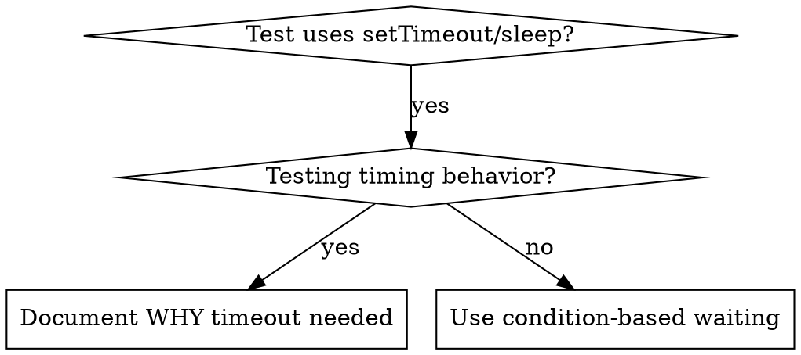

# 基于条件的等待

## 概述

不稳定的测试通常会通过设置任意延迟来猜测执行时间。这会导致竞争条件：测试在高速机器上通过，但在高负载环境或持续集成（CI）中却会失败。

**核心原则：**等待你真正关心的实际条件，而不是对所需时间的猜测。

## 何时使用



**适用场景：**
- 测试中存在任意延迟（`setTimeout`、`sleep`、`time.sleep()`）
- 测试结果不稳定（有时通过，在高负载下失败）
- 并行运行时测试超时
- 等待异步操作完成

**不应在以下情况使用：**
- 测试实际的定时行为（去抖动、限流间隔）
- 若使用任意超时，务必说明原因

## 核心模式

```typescript
// ❌ BEFORE: Guessing at timing
await new Promise(r => setTimeout(r, 50));
const result = getResult();
expect(result).toBeDefined();

// ✅ AFTER: Waiting for condition
await waitFor(() => getResult() !== undefined);
const result = getResult();
expect(result).toBeDefined();
```

## 快速模式

| 场景 | 模式 |
|----------|---------|
| 等待事件 | `waitFor(() => events.find(e => e.type === 'DONE'))` |
| 等待状态 | `waitFor(() => machine.state === 'ready')` |
| 等待计数 | `waitFor(() => items.length >= 5)` |
| 等待文件 | `waitFor(() => fs.existsSync(path))` |
| 复杂条件 | `waitFor(() => obj.ready && obj.value > 10)` |

## 实现

通用轮询函数：
```typescript
async function waitFor<T>(
  condition: () => T | undefined | null | false,
  description: string,
  timeoutMs = 5000
): Promise<T> {
  const startTime = Date.now();

  while (true) {
    const result = condition();
    if (result) return result;

    if (Date.now() - startTime > timeoutMs) {
      throw new Error(`Timeout waiting for ${description} after ${timeoutMs}ms`);
    }

    await new Promise(r => setTimeout(r, 10)); // Poll every 10ms
  }
}
```

请参阅本目录中的 `condition-based-waiting-example.ts`，其中包含来自实际调试会话的完整实现，以及特定领域的辅助函数（`waitForEvent`、`waitForEventCount`、`waitForEventMatch`）。

## 常见错误

**❌ 轮询过快：** `setTimeout(check, 1)` - 浪费 CPU 资源
**✅ 修复：** 每 10 毫秒轮询一次

**❌ 未设置超时：** 若条件永远不满足，将无限循环
**✅ 修复：** 始终设置超时并明确报错

**❌ 数据过时：** 循环前缓存状态
**✅ 修复：** 在循环内调用获取器以获取最新数据

## 何时“任意超时”才是正确的

```typescript
// Tool ticks every 100ms - need 2 ticks to verify partial output
await waitForEvent(manager, 'TOOL_STARTED'); // First: wait for condition
await new Promise(r => setTimeout(r, 200));   // Then: wait for timed behavior
// 200ms = 2 ticks at 100ms intervals - documented and justified
```

**要求：**
1. 首先等待触发条件
2. 基于已知时间（而非猜测）
3. 添加注释说明原因

## 实际影响

来自调试记录（2025-10-03）：
- 修复了 3 个文件中 15 个不稳定的测试用例
- 通过率：60% → 100%
- 执行时间：加快 40%
- 不再出现竞争条件
