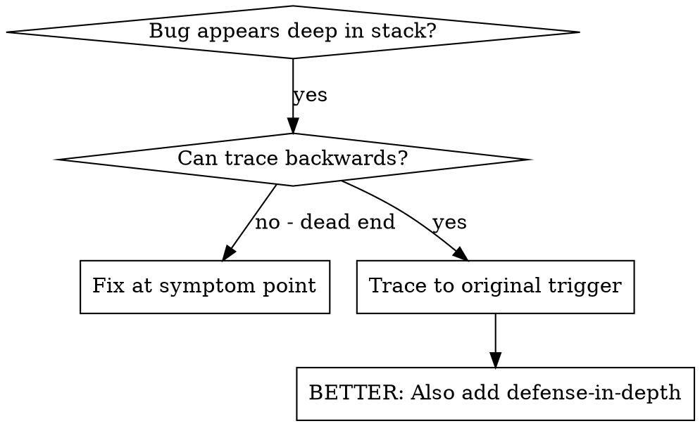
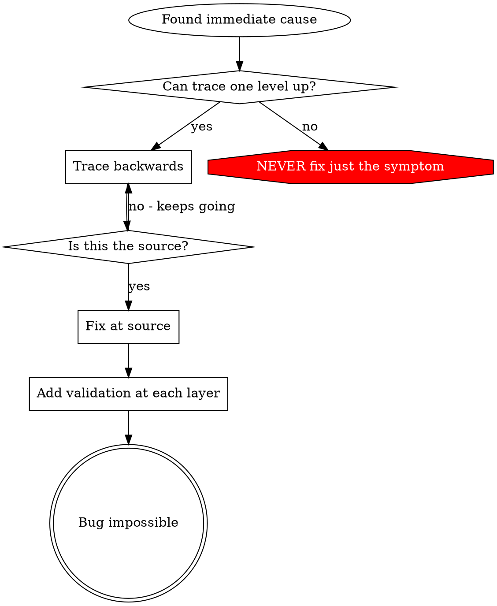

# 根本原因追踪

## 概述

错误往往隐藏在调用栈的深处（例如在错误的目录下执行 `git init`、文件创建在错误的位置、使用错误的路径打开数据库）。你的本能是修复错误出现的位置，但这只是治标不治本。

**核心原则：** 沿调用链向后追溯，直至找到最初的触发点，然后从源头进行修复。

## 何时使用



**适用场景：**
- 错误发生在执行过程的深处 （而非在入口点）
- 调用堆栈显示冗长的调用链
- 无法确定无效数据的来源
- 需要找出是哪项测试/代码触发了问题

## 追踪流程

### 1. 观察症状
```
Error: git init failed in ~/project/packages/core
```

### 2. 找出直接原因
**是哪段代码直接导致了这个问题？**
```typescript
await execFileAsync('git', ['init'], { cwd: projectDir });
```

### 3. 提问：是什么调用了这段代码？
```typescript
WorktreeManager.createSessionWorktree(projectDir, sessionId)
  → called by Session.initializeWorkspace()
  → called by Session.create()
  → called by test at Project.create()
```

### 4. 继续向上追踪
**传递了什么值？**
- `projectDir = ''`（空字符串！）
- 空字符串，因为 `cwd` 解析为 `process.cwd()`
- 那就是源代码目录！

### 5. 查找原始触发点
**空字符串来自哪里？**
```typescript
const context = setupCoreTest(); // Returns { tempDir: '' }
Project.create('name', context.tempDir); // Accessed before beforeEach!
```

## 添加堆栈跟踪

当无法手动追踪时，请添加仪器化代码：

```typescript
// Before the problematic operation
async function gitInit(directory: string) {
  const stack = new Error().stack;
  console.error('DEBUG git init:', {
    directory,
    cwd: process.cwd(),
    nodeEnv: process.env.NODE_ENV,
    stack,
  });

  await execFileAsync('git', ['init'], { cwd: directory });
}
```

**重要提示：** 在测试中使用 `console.error()`（而非日志记录器——日志记录器可能不会显示）

**运行并捕获：**
```bash
npm test 2>&1 | grep 'DEBUG git init'
```

**分析堆栈跟踪：**
- 查找测试文件名
- 找出触发调用的行号
- 识别模式（是同一个测试？相同的参数？）

## 查找导致污染的测试

如果测试过程中出现了某些现象，但你不知道是哪一个测试：

使用本目录中的二分法脚本 `find-polluter.sh`：

```bash
./find-polluter.sh '.git' 'src/**/*.test.ts'
```

该脚本会逐个运行测试，并在第一个污染源处停止。用法请参见脚本。

## 实际案例：空的 projectDir

**症状：** `.git` 在 `packages/core/` 中被创建（源代码）

**追踪链：**
1. `git init` 在 `process.cwd()` 中运行 ← cwd 参数为空
2. 调用 WorktreeManager 时 projectDir 为空
3. Session.create() 传入空字符串
4. 测试在 beforeEach 之前访问了 `context.tempDir`
5. setupCoreTest() 初始返回 `{ tempDir: '' }`

**根本原因：** 顶级变量初始化时访问了空值

**修复方案：** 将 tempDir 改为 getter 方法，若在 beforeEach 之前被访问则抛出异常

**同时增加了多层防御机制：**
- 第 1 层：Project.create() 验证目录
- 第 2 层：WorkspaceManager 验证目录不为空
- 第 3 层：NODE_ENV 保护机制拒绝在 tmpdir 之外执行 git init
- 第 4 层：在执行 git init 之前记录堆栈跟踪

## 关键原则



**切勿仅修复错误出现的位置。** 应追溯至源头以找出最初的触发点。

## 堆栈跟踪提示

**在测试中：** 使用 `console.error()` 而非 logger——logger 可能会被抑制
**操作前：** 在危险操作执行前进行日志记录，而非在失败后
**包含上下文：** 目录、当前工作目录、环境变量、时间戳
**捕获调用栈：** `new Error().stack` 可显示完整的调用链

## 实际影响

来自调试会话（2025-10-03）：
- 通过 5 级跟踪找到了根本原因
- 从源头修复（getter 验证）
- 增加了 4 层防护
- 1847 个测试通过，零污染
