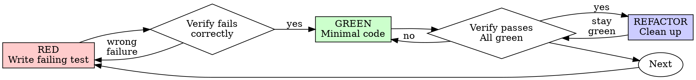

# 测试驱动开发（TDD）

## 概述

先编写测试。观察测试失败。编写最少的代码使测试通过。

**核心原则：** 如果你没有观察到测试失败，你就无法确定它是否测试了正确的内容。

**违反规则的字面意义，就是违背规则的精神。**

## 何时使用

**始终适用：**
- 新功能
- 修复 bug
- 重构
- 行为变更

**例外情况（请咨询你的开发伙伴）：**
- 一次性原型
- 生成的代码
- 配置文件

在想“就这一次跳过 TDD 吧”？停下。那是自我辩解。

## 铁律

```
NO PRODUCTION CODE WITHOUT A FAILING TEST FIRST
```

先写代码再写测试？删掉它。重头再来。

**没有例外：**
- 不要将其保留为“参考”
- 编写测试时不要“改写”它
- 不要看它
- 删除就是删除

根据测试从头开始实现。句号。

## 红-绿-重构



### RED - 编写会失败的测试

编写一个最简测试，展示应发生的情况。

<正确示例>
```typescript
test('retries failed operations 3 times', async () => {
  let attempts = 0;
  const operation = () => {
    attempts++;
    if (attempts < 3) throw new Error('fail');
    return 'success';
  };

  const result = await retryOperation(operation);

  expect(result).toBe('success');
  expect(attempts).toBe(3);
});
```
名称清晰，测试真实行为，仅关注一件事
</正确示例>

<错误示例>
```typescript
test('retry works', async () => {
  const mock = jest.fn()
    .mockRejectedValueOnce(new Error())
    .mockRejectedValueOnce(new Error())
    .mockResolvedValueOnce('success');
  await retryOperation(mock);
  expect(mock).toHaveBeenCalledTimes(3);
});
```
名称模糊，测试的是模拟对象而非代码
</错误示例>

**要求：**
- 仅测试一种行为
- 名称清晰
- 测试真实代码（除非不可避免，否则不使用模拟对象）

### 验证 RED - 观察测试失败

**强制要求。绝不跳过。**

```bash
npm test path/to/test.test.ts
```

确认：
- 测试失败 （而非报错）
- 失败信息符合预期
- 失败原因是功能缺失（而非拼写错误）

**测试通过了？** 说明你测试的是现有行为。修正测试。

**测试报错了？** 修正错误，重新运行直到测试正确失败。

### 绿色 - 最小代码

编写最简单的代码以通过测试。

<正确>
```typescript
async function retryOperation<T>(fn: () => Promise<T>): Promise<T> {
  for (let i = 0; i < 3; i++) {
    try {
      return await fn();
    } catch (e) {
      if (i === 2) throw e;
    }
  }
  throw new Error('unreachable');
}
```
仅够通过测试
</正确>

<错误>
```typescript
async function retryOperation<T>(
  fn: () => Promise<T>,
  options?: {
    maxRetries?: number;
    backoff?: 'linear' | 'exponential';
    onRetry?: (attempt: number) => void;
  }
): Promise<T> {
  // YAGNI
}
```
过度设计
</错误>

不要添加功能、重构其他代码，或超出测试范围进行“改进”。

### 验证“绿色”状态 - 确保测试通过

**必做。**

```bash
npm test path/to/test.test.ts
```

确认：
- 测试通过
- 其他测试仍通过
- 输出完好无损（无错误、无警告）

**测试失败？** 修复代码，而非测试。

**其他测试失败？** 立即修复。

### 重构 - 清理

仅在测试通过后：
- 移除冗余代码
- 优化命名
- 提取辅助函数

保持测试通过。不要添加新行为。

### 重复

针对下一个功能，处理下一个失败的测试。

## 优质测试

| 质量 | 好 | 差 |
|---------|------|-----|
| **最小化** | 只关注一件事。名称中包含“and”？拆分它。 | `test('validates email and domain and whitespace')` |
| **清晰** | 名称描述行为 | `test('test1')` |
| **体现意图** | 演示预期 API | 模糊了代码应执行的内容 |

## 为什么顺序很重要

**“我稍后会编写测试来验证它是否正常工作”**

代码编写后立即编写的测试会立即通过。立即通过并不能证明什么：
- 可能测试了错误的内容
- 可能测试的是实现，而非行为
- 可能遗漏了你忘记的边界情况
- 你从未亲眼看到它捕获到该错误

测试先行迫使你看到测试失败，从而证明它确实在测试某些内容。

**“我已经手动测试过所有边界情况了”**

手动测试是临时性的。你以为自己测试了所有情况，但：
- 没有测试内容的记录
- 代码变更后无法重跑
- 压力下容易遗漏某些情况
- “我试的时候能用” ≠ 全面

自动化测试是有系统性的。它们每次运行的方式都一样。

**“删除 X 小时的工作成果是一种浪费”**

沉没成本谬误。时间已经过去了。你现在面临的选择是：
- 删除并使用 TDD 重写（再花 X 小时，信心度高）
- 保留代码并后续添加测试（30 分钟，可信度低，可能存在 bug）

真正的“浪费”是保留无法信赖的代码。没有真实测试的运行代码就是技术债务。

**“TDD 过于教条，务实意味着灵活适应”**

TDD 本身就是务实的：
- 在提交前发现 bug（比事后调试更快）
- 防止回归（测试能立即捕获功能失效）
- 记录行为（测试展示了如何使用代码）
- 支持重构（自由修改，测试会捕获功能失效）

“务实”的捷径 = 生产环境中的调试 = 效率更低。

**“事后测试也能实现相同目标——关键在于精神而非形式”**

不。事后测试回答的是“这做了什么？”，而测试先行回答的是“这应该做什么？”

“先实现后测试”会受到你具体实现方式的偏颇影响。你测试的是自己构建的内容，而非需求本身。你验证的是记忆中的边界情况，而非实际发现的边界情况。

“先测试后实现”迫使你在实现之前发现边界情况。“先实现后测试”则只是验证你是否记住了所有情况（实际上你并没有）。

事后花30分钟写测试 ≠ TDD。你获得了代码覆盖率，却失去了测试有效的证明。

## 常见的自我辩解

| 借口 | 现实 |
|--------|---------|
| “太简单，没必要测试” | 简单的代码也会出错。测试只需30秒。 |
| “我稍后再测试” | 测试立即通过并不能证明什么。 |
| “事后测试也能达到同样目标” | 事后测试 = “这到底做什么？” 测试先行 = “这应该做什么？” |
| “已经手动测试过了” | 临时测试 ≠ 系统化测试。没有记录，无法重跑。 |
| “删除 X 小时的工作是浪费” | 沉没成本谬误。保留未经验证的代码就是技术债务。 |
| “保留作参考，先写测试” | 你会对其进行调整。这就是事后测试。删除就意味着彻底删除。 |
| “需要先探索” | 没问题。抛开探索，从TDD开始。 |
| “测试困难 = 设计不清” | 倾听测试。难以测试 = 难以使用。 |
| “TDD 会拖慢我的进度” | TDD 比调试更快。务实 = 先写测试。 |
| “手动测试更快” | 手动测试无法验证边界情况。每次修改你都得重新测试。 |
| “现有代码没有测试” | 你在改进它。 为现有代码添加测试。 |

## 危险信号——立即停止并重头开始

- 先写代码后写测试
- 实现后才写测试
- 测试立即通过
- 无法解释测试失败的原因
- “稍后”再添加测试
- 为“就这一次”找借口
- “我已经手动测试过了”
- “事后编写测试也能达到同样目的”
- “重在精神而非仪式”
- “保留作参考”或“改编现有代码”
- “已经花了 X 小时，删掉太浪费”
- “TDD 太教条，我更务实”
- “这不一样，因为……”

**所有这些都意味着：删除代码。用 TDD 从头开始。**

## 示例：修复 bug

**bug：** 接受空邮件

**RED**
```typescript
test('rejects empty email', async () => {
  const result = await submitForm({ email: '' });
  expect(result.error).toBe('Email required');
});
```

**验证 RED**
```bash
$ npm test
FAIL: expected 'Email required', got undefined
```

**绿色**
```typescript
function submitForm(data: FormData) {
  if (!data.email?.trim()) {
    return { error: 'Email required' };
  }
  // ...
}
```

**验证绿色**
```bash
$ npm test
PASS
```

**重构**
如有必要，提取多个字段的验证逻辑。

## 验证清单

在标记工作完成之前：

- [ ] 每个新函数/方法都有对应的测试
- [ ] 在实现之前，已观察到每个测试均失败
- [ ] 每个测试因预期原因失败（功能缺失，而非拼写错误）
- [ ] 编写了最少的代码以通过每个测试
- [ ] 所有测试均通过
- [ ] 输出结果完美无瑕（无错误、无警告）
- [ ] 测试使用真实代码（仅在不可避免时才使用模拟对象）
- [ ] 已覆盖边界情况和错误

无法勾选所有项目？说明你跳过了 TDD。请重新开始。

## 遇到困难时

| 问题 | 解决方案 |
|---------|----------|
| 不知道如何测试 | 编写理想的 API。先编写断言。向你的合作伙伴请教。 |
| 测试过于复杂 | 设计过于复杂。简化接口。 |
| 必须模拟所有内容 | 代码耦合度过高。使用依赖注入。 |
| 测试设置过于庞大 | 提取辅助函数。仍然复杂？简化设计。 |

## 集成调试

发现 bug 了？编写能复现该问题的失败测试。遵循 TDD 循环。测试既能验证修复效果，又能防止回归。

切勿在没有测试的情况下修复 bug。

## 测试反模式

在添加模拟对象或测试工具时，请阅读 [testing-anti-patterns.md](testing-anti-patterns.md)，以避免常见的陷阱：
- 测试模拟行为而非真实行为
- 在生产类中添加仅用于测试的方法
- 在未理解依赖关系的情况下进行模拟

## 最终规则

```
Production code → test exists and failed first
Otherwise → not TDD
```

未经人类伙伴许可，不得出现任何例外。
