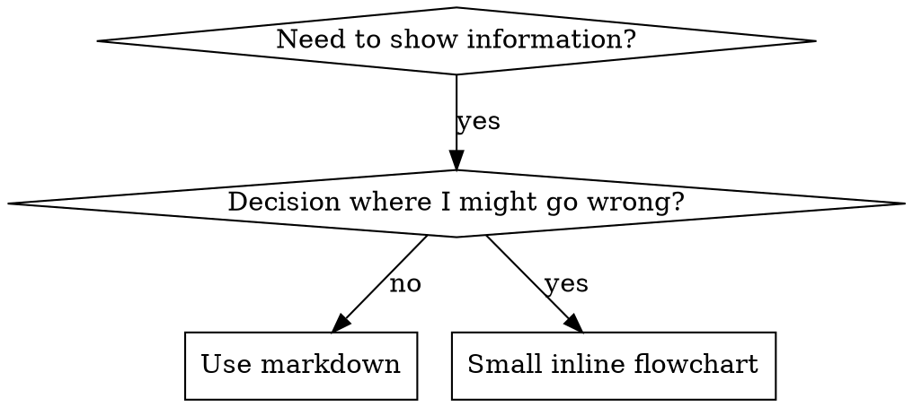

# 编写技能

## 概述

**编写技能就是将测试驱动开发（TDD）应用于流程文档编写。**

**个人技能存储在运行时的技能目录中** 

你编写测试用例（包含子代理的压力测试场景），观察它们失败（基准行为），编写技能（文档），观察测试通过（代理符合规范），并进行重构（弥补漏洞）。

**核心原则：** 如果你没有观察到在缺少该技能的情况下代理出现失败，你就无法确定该技能是否教导了正确的内容。

**必备知识：**在使用本技能前，你必须理解“superpowers:test-driven-development”。该技能定义了基础的“RED-GREEN-REFACTOR”循环。本技能将 TDD 方法应用于文档编写。

**官方指南：** 有关 Anthropic 的官方技能编写最佳实践，请参阅 anthropic-best-practices.md。该文档提供了额外的模式和指南，以补充本技能中以 TDD 为核心的方法。

## 什么是技能？

**技能**是针对经过验证的技术、模式或工具的参考指南。技能有助于未来的代理查找并应用有效的方法。

**技能是：** 可重用的技术、模式、工具及参考指南

**技能不是：** 关于你曾经如何解决某个问题的叙述

## 技能的 TDD 映射

| TDD 概念 | 技能创建 |
|-------------|----------------|
| **测试用例** | 包含子代理的压力场景 |
| **生产代码** | 技能文档（SKILL.md） |
| **测试失败（RED）** | 代理在没有技能的情况下违反规则（基线） |
| **测试通过（GREEN）** | 代理在具备技能时遵守规则 |
| **重构** | 在保持合规的同时弥补漏洞 |
| **先写测试** | 在编写技能之前运行基线场景 |
| **观察测试失败** | 记录代理使用的确切推理过程 |
| **最小代码** | 编写针对这些具体违规行为的技能 |
| **观察其通过** | 验证代理现已符合规范 |
| **重构循环** | 发现新的合理化理由 → 修复 → 重新验证 |

整个技能创建过程遵循“RED-GREEN-REFACTOR”模式。

## 何时创建技能

**创建时机：**
- 该技术对你而言并非显而易见
- 你会在不同项目中反复引用它
- 该模式具有广泛适用性（非项目特定）
- 其他人也能从中受益

**不应创建的情况：**
- 一次性解决方案
- 已在其他地方有详细记录的标准做法
- 项目特定的约定 （请放入你的说明文件中）
- 机械性约束（如果可以通过正则表达式/验证来强制执行，请将其自动化——将文档留给需要判断的情况）

## 技能类型

### 技术
包含具体步骤的具体方法（基于条件的等待、根本原因追踪）

### 模式
解决问题的思维方式（使用标志进行扁平化、测试不变量）

### 参考资料
API 文档、语法指南、工具文档 （Office文档）

## 目录结构

```
skills/
  skill-name/
    SKILL.md              # Main reference (required)
    supporting-file.*     # Only if needed
```

**扁平化命名空间**——所有技能均位于一个可搜索的命名空间内

**以下内容应单独存为文件：**
1. **篇幅较长的参考资料**（100行以上）——API文档、全面的语法说明
2. **可复用工具** — 脚本、实用程序、模板

**保留在内联内容中：**
- 原则与概念
- 代码模式（< 50 行）
- 其他所有内容

## SKILL.md 结构

**前置信息（YAML）：**
- 两个必填字段：`name` 和 `description`（所有支持的字段请参见 [agentskills.io/specification](https://agentskills.io/specification)）
- 总字符数上限为 1024 个
- `name`：仅限使用字母、数字和连字符（不允许使用括号和特殊字符）
- `description`：采用第三人称，仅描述“何时使用”（而非“功能说明”）
  - 以“当……时使用”开头.”，以突出触发条件
  - 包含具体的症状、情境和上下文
  - **切勿总结技能的流程或工作流**（原因请参见 SDO 部分）
  - 尽可能控制在 500 个字符以内

```markdown
---
name: Skill-Name-With-Hyphens
description: Use when [specific triggering conditions and symptoms]
---

# Skill Name

## Overview
What is this? Core principle in 1-2 sentences.

## When to Use
[Small inline flowchart IF decision non-obvious]

Bullet list with SYMPTOMS and use cases
When NOT to use

## Core Pattern (for techniques/patterns)
Before/after code comparison

## Quick Reference
Table or bullets for scanning common operations

## Implementation
Inline code for simple patterns
Link to file for heavy reference or reusable tools

## Common Mistakes
What goes wrong + fixes

## Real-World Impact (optional)
Concrete results
```

## 技能发现优化 (SDO)

**对技能发现至关重要：**未来的智能代理需要“找到”您的技能

### 1. 丰富的描述字段

**目的：**智能代理会阅读描述来决定针对特定任务加载哪些技能。请让描述能回答：“我现在应该阅读这个技能吗？”

**格式：**以“适用于以下情况...”开头，重点突出触发条件

**关键：描述 = 何时使用，而非技能功能**

描述应仅说明触发条件。切勿在描述中总结技能的流程或工作流。

**为何重要：** 测试表明，当描述总结了技能的工作流时，代理可能会直接遵循描述，而不是阅读完整的技能内容。例如，一条写着“任务之间的代码审查”的描述，导致代理只进行了一次审查，尽管该技能的流程图明确显示需要进行两次审查（先是规范合规性审查，然后是代码质量审查）。

当描述修改为仅“在执行包含独立任务的实施方案时使用”（未总结工作流）后，操作员正确阅读了流程图，并遵循了两阶段的审查流程。

**陷阱：**总结工作流的描述会让操作员走捷径。技能主体内容便成了被操作员跳过的文档。

```yaml
# ❌ BAD: Summarizes workflow - agents may follow this instead of reading skill
description: Use when executing plans - dispatches subagent per task with code review between tasks

# ❌ BAD: Too much process detail
description: Use for TDD - write test first, watch it fail, write minimal code, refactor

# ✅ GOOD: Just triggering conditions, no workflow summary
description: Use when executing implementation plans with independent tasks in the current session

# ✅ GOOD: Triggering conditions only
description: Use when implementing any feature or bugfix, before writing implementation code
```

**要点：**
- 使用具体的触发条件、症状和情境来表明该技能适用
- 描述*问题*（竞态条件、行为不一致），而非*特定语言的症状*（setTimeout、sleep）
- 除非技能本身具有特定技术属性，否则触发条件应保持技术中立
- 如果技能具有特定技术属性，请在触发条件中明确说明
- 使用第三人称书写（嵌入系统提示中）
- **切勿总结技能的流程或工作流**

```yaml
# ❌ BAD: Too abstract, vague, doesn't include when to use
description: For async testing

# ❌ BAD: First person
description: I can help you with async tests when they're flaky

# ❌ BAD: Mentions technology but skill isn't specific to it
description: Use when tests use setTimeout/sleep and are flaky

# ✅ GOOD: Starts with "Use when", describes problem, no workflow
description: Use when tests have race conditions, timing dependencies, or pass/fail inconsistently

# ✅ GOOD: Technology-specific skill with explicit trigger
description: Use when using React Router and handling authentication redirects
```

### 2. 关键词覆盖

使用客服人员会搜索的词汇：
- 错误信息：“Hook 超时”、“ENOTEMPTY”、“竞争条件”
- 症状：“不稳定”、“卡死”、“僵尸进程”、“污染”
- 同义词：“超时/卡死/冻结”、“清理/释放/afterEach”
- 工具：实际命令、库名、文件类型

### 3. 描述性命名

**使用主动语态，动词在前：**
- ✅ `creating-skills` 而不是 `skill-creation`
- ✅ `condition-based-waiting` 而不是 `async-test-helpers`

### 4. 令牌效率（关键）

**问题：**入门技能和高频技能会被加载到每一段对话中。每个令牌都至关重要。

**目标词数：**
- 入门工作流：每个少于 150 个词
- 频繁加载的技能：总计 <200 词
- 其他技能：<500 词（仍需保持简洁）

**优化技巧：**

**将细节移至工具帮助文档：**
```bash
# ❌ BAD: Document all flags in SKILL.md
search-conversations supports --text, --both, --after DATE, --before DATE, --limit N

# ✅ GOOD: Reference --help
search-conversations supports multiple modes and filters. Run --help for details.
```

**使用交叉引用：**
```markdown
# ❌ BAD: Repeat workflow details
When searching, dispatch subagent with template...
[20 lines of repeated instructions]

# ✅ GOOD: Reference other skill
Always use subagents (50-100x context savings). REQUIRED: Use [other-skill-name] for workflow.
```

**压缩示例：**
```markdown
# ❌ BAD: Verbose example (42 words)
your human partner: "How did we handle authentication errors in React Router before?"
You: I'll search past conversations for React Router authentication patterns.
[Dispatch subagent with search query: "React Router authentication error handling 401"]

# ✅ GOOD: Minimal example (20 words)
Partner: "How did we handle auth errors in React Router?"
You: Searching...
[Dispatch subagent → synthesis]
```

**消除冗余：**
- 不要重复交叉引用技能中的内容
- 不要解释从命令中显而易见的内容
- 不要包含同一模式的多个示例

**验证：**
```bash
wc -w skills/path/SKILL.md
# getting-started workflows: aim for <150 each
# Other frequently-loaded: aim for <200 total
```

**根据操作内容或核心洞见命名：**
- ✅ `condition-based-waiting` > `async-test-helpers`
- ✅ `using-skills` 而非 `skill-usage`
- ✅ `flatten-with-flags` > `data-structure-refactoring`
- ✅ `root-cause-tracing` > `debugging-techniques`

**动名词（-ing形式）适用于描述过程：**
- `creating-skills`、`testing-skills`、`debugging-with-logs`
- 主动语态，描述你正在采取的行动

### 5. 与其他技能交叉引用

**在编写引用其他技能的文档时：**

仅使用技能名称，并明确标注要求：
- ✅ 正确：`**REQUIRED SUB-SKILL:** Use superpowers:test-driven-development`
- ✅ 正确：`**REQUIRED BACKGROUND:** You MUST understand superpowers:systematic-debugging`
- ❌ 错误：`See skills/testing/test-driven-development`（无法明确是否为必备）
- ❌ 错误示例：`@skills/testing/test-driven-development/SKILL.md`（强制加载，消耗上下文）

**为何不使用 @ 链接：** `@` 语法会立即强制加载文件，在您真正需要之前就消耗了 200k+ 的上下文。

## 流程图的使用



**仅在以下情况下使用流程图：**
- 非显而易见的决策点
- 可能过早终止的流程循环
- “何时使用 A 而非 B”的决策

**切勿将流程图用于：**
- 参考资料 → 表格、列表
- 代码示例 → Markdown 代码块
- 线性说明 → 编号列表
- 无语义含义的标签（step1、helper2）

有关 Graphviz 样式规则，请参阅本目录中的 `graphviz-conventions.dot`。

**为人类伙伴可视化：** 使用本目录中的 `render-graphs.js` 将技能流程图渲染为 SVG：
```bash
./render-graphs.js ../some-skill           # Each diagram separately
./render-graphs.js ../some-skill --combine # All diagrams in one SVG
```

## 代码示例

**一个优秀的示例胜过许多平庸的示例**

选择最相关的语言：
- 测试技术 → TypeScript/JavaScript
- 系统调试 → Shell/Python
- 数据处理 → Python

**优秀示例：**
- 完整且可运行
- 注释详尽，解释“为什么”
- 源自真实场景
- 清晰展示模式
- 便于改编（非通用模板）

**切勿：**
- 使用 5 种及以上语言实现
- 创建填空式模板
- 编写生硬的示例

你擅长移植代码——一个优秀的示例就足够了。

## 文件组织

### 自包含技能
```
defense-in-depth/
  SKILL.md    # Everything inline
```
适用场景：所有内容都能容纳其中，无需大量参考资料

### 包含可复用工具的技能
```
condition-based-waiting/
  SKILL.md    # Overview + patterns
  example.ts  # Working helpers to adapt
```
适用场景：工具是可重用的代码，而非单纯的叙述性内容

### 包含大量参考资料的技能
```
pptx/
  SKILL.md       # Overview + workflows
  pptxgenjs.md   # 600 lines API reference
  ooxml.md       # 500 lines XML structure
  scripts/       # Executable tools
```
适用场景：参考资料过多，无法内联呈现

## 铁律（与TDD一致）

```
NO SKILL WITHOUT A FAILING TEST FIRST
```

此规则适用于新技能以及对现有技能的编辑。

先编写技能再测试？删除它。重头再来。
未测试就编辑技能？同样违反规则。

**无例外：**
- 不适用于“简单添加”
- 不适用于“仅添加一个部分”
- 不适用于“文档更新”
- 不要将未经测试的更改保留为“参考”
- 运行测试时不要“调整”
- 删除即删除

**必备背景知识：**“超能力：测试驱动开发”技能解释了为何这很重要。相同原则也适用于文档。

## 测试所有技能类型

不同的技能类型需要不同的测试方法：

### 纪律约束型技能（规则/要求）

**示例：** TDD、完成前验证、先设计后编码

**测试方法：**
- 学术性问题：他们是否理解规则？
- 压力情境：在压力下能否遵守规则？
- 多种压力的组合：时间 + 沉没成本 + 精疲力竭
- 识别合理化借口并添加明确的反驳

**成功标准：** 代理人在最大压力下仍遵守规则

### 技术技能（操作指南）

**示例：** 基于条件的等待、根本原因追踪、防御性编程

**测试方法：**
- 应用场景：能否正确应用该技巧？
- 变体场景：能否处理边界情况？
- 信息缺失测试：说明中是否存在漏洞？

**成功标准：** 智能体能成功将技巧应用于新场景

### 模式技能（思维模型）

**示例：** 降低复杂度、信息隐藏概念

**测试方法：**
- 识别场景：他们能否识别出何时适用该模式？
- 应用场景：能否运用该思维模型？
- 反例：是否知道何时不应应用？

**成功标准：** 智能体能正确识别何时及如何应用该模式

### 参考技能（文档/API）

**示例：** API 文档、命令参考、库指南

**测试方法：**
- 检索场景：能否找到正确的信息？
- 应用场景：能否正确使用所找到的信息？
- 缺口测试：是否涵盖了常见用例？

**成功标准：** 智能体能够查找并正确应用参考信息

## 跳过测试的常见借口

| 借口 | 现实 |
|--------|---------|
| “技能显然很明确” | 对你来说明确 ≠ 对其他智能体来说明确。 请进行测试。 |
| “这只是参考资料” | 参考资料可能存在缺漏或表述不清的部分。请测试检索功能。 |
| “测试太过分了” | 未经测试的技能必然存在问题。15 分钟的测试能节省数小时。 |
| “如果出现问题我会测试” | 问题 = 代理无法使用技能。请在部署前进行测试。 |
| “测试太繁琐” | 测试比在生产环境中调试有缺陷的技能要省事得多。 |
| “我确信它没问题” | 过度自信必然导致问题。无论如何都要测试。 |
| “学术审查就够了” | 阅读 ≠ 使用。必须测试应用场景。 |
| “没时间测试” | 部署未经测试的技能，只会浪费更多时间在后续修复上。 |

**所有这些都意味着：部署前必须测试。没有例外。**

## 根据故障类型调整测试方案

在编写指导原则之前，先对基准故障进行分类。针对某一种故障类型设计的防弹方案，在另一种故障类型上往往会产生可测量的反效果。

| 基准故障 | 正确方案 | 错误方案 |
|---|---|---|
| 在压力下跳过/违反规则（明知不该，却仍照做） | 禁止条款 + 合理化说明表 + 警示标志（参见下文“防弹设计”） | 柔性指导（“建议……”、“请考虑……”） |
| 虽符合规则，但输出形式错误（提示语臃肿、结论埋没、重复说明规格） | 积极的配方或契约：明确输出“是什么”——包括各部分及其顺序 | 禁止清单（“不要重复说明”、“切勿叙述”） |
| 在已生成的内容中遗漏了必填元素 | 结构性：模板中需填写的“必填”字段或槽位 | 模板附近的文字提示 |
| 行为应取决于某个条件 | 基于可观察谓词的条件（“如果存在简报，则引用它”） | 无条件规则 + 豁免条款 |

**为何禁令在问题塑造上会适得其反：**在“使提示自成体系”这一竞争性激励下，代理会与“不要做X”进行博弈。在关于任务分配提示指导的头对头措辞测试中，禁令组产生的非预期内容明显多于配方组 （分布完全分离），且表现甚至比无指导的对照组更差——请针对自身案例进行微观测试而非直接假设，但切勿默认采用禁止性规则。操作指南不留任何谈判余地：输出要么符合规定的格式，要么不符合。

**无论选择哪种形式，均需遵循以下规则：**
- **不得包含细微条款。** “除非重要，否则不要 X”会重新开启协商——在同一措辞测试中，向获胜的“操作指南”附加单个细微条款，会使其从一致性降级为冗余。 将真正的例外情况作为基于可观察谓词的独立条件进行表达。
- **豁免条款不具有作用域。** “此限制不适用于代码块”仍会抑制代码块。如果输出的一部分必须豁免，请重新结构化，使规则无法触及该部分。

## 防止技能被合理化的防弹措施

那些强制执行纪律的技能（如 TDD）需要抵御合理化。执行者很聪明，在压力下会找到漏洞。

**适用范围：**本工具包针对纪律执行失败的情况——即开发者明知规则却在压力下将其忽略。对于格式错误的输出或遗漏的元素，基于禁止的防钻空子措施会适得其反；请改用“根据失败情况调整形式”中的方法。

**心理学注释：** 理解说服技巧为何有效，有助于你系统地应用它们。请参阅 persuasion-principles.md，了解关于权威、承诺、稀缺性、社会证明和统一原则的研究基础（Cialdini, 2021；Meincke 等，2025）。

### 明确封堵所有漏洞

不要仅仅陈述规则——还要禁止具体的规避手段：

<错误>
```markdown
Write code before test? Delete it.
```
</错误>

<正确>
```markdown
Write code before test? Delete it. Start over.

**No exceptions:**
- Don't keep it as "reference"
- Don't "adapt" it while writing tests
- Don't look at it
- Delete means delete
```
</正确>

### 应对“精神与文字”之争

尽早添加基础原则：

```markdown
**Violating the letter of the rules is violating the spirit of the rules.**
```

这能彻底杜绝“我遵循的是精神而非文字”这一类借口。

### 构建合理化理由表

从基线测试中收集合理化理由（参见下文“测试”部分）。代理提出的每条借口都要列入该表：

```markdown
| Excuse | Reality |
|--------|---------|
| "Too simple to test" | Simple code breaks. Test takes 30 seconds. |
| "I'll test after" | Tests passing immediately prove nothing. |
| "Tests after achieve same goals" | Tests-after = "what does this do?" Tests-first = "what should this do?" |
```

### 创建红旗清单

让代理在找借口时能轻松进行自我检查：

```markdown
## Red Flags - STOP and Start Over

- Code before test
- "I already manually tested it"
- "Tests after achieve the same purpose"
- "It's about spirit not ritual"
- "This is different because..."

**All of these mean: Delete code. Start over with TDD.**
```

### 更新 SDO 以包含违规征兆

在描述中添加：即将违反规则时的征兆：

```yaml
description: use when implementing any feature or bugfix, before writing implementation code
```

## 技能的“红-绿-重构”流程

遵循 TDD 循环：

### 红：编写会失败的测试（基线）

在子代理未具备该技能的情况下，运行压力测试场景。记录确切行为：
- 它们做出了哪些选择？
- 它们使用了哪些辩解理由（逐字记录）？
- 哪些压力触发了违规行为？

这就是“观察测试失败”——在编写技能之前，必须先了解代理的自然行为。

### GREEN：编写最小化技能

编写针对这些具体辩解理由的技能。不要为假设性情况添加额外内容。

在具备该技能的情况下运行相同场景。代理此时应能遵守规则。

### 重构：堵住漏洞

代理找到了新的合理化理由？添加明确的反驳措施。反复测试直至万无一失。

### 在完整场景测试前进行微测试

完整的压力场景测试是最终关卡，但每次迭代都耗时且成本高昂。请先通过微测试验证措辞本身：

1. **每次调用一个全新上下文样本** —— 原始 API 调用，或若无法访问 API 则使用单次运行的子代理。系统提示 = 指导将运行的真实上下文（完整的技能或提示模板，而非孤立的指导）；用户消息 = 旨在诱发失败的任务。
2. **务必包含一个无指导的对照组。**如果对照组未出现故障，则无需修复——停止操作，不要编写指导内容。
3. **每个变体至少进行 5 次重复测试。**单个样本会产生误导。
4. **手动阅读每个被标记的匹配结果。** 如果你愿意，可以程序化地进行评分，但模板的重复和引用的反例会伪装成匹配结果；仅靠自动计数会高估失败和成功的数量。
5. **变异性即为指标。** 当指导方案生效后，各轮测试结果应趋于一致。若五轮测试中出现五种不同解读，则说明措辞不够严谨——在添加词句前，请先精简表述形式。

微测试用于验证措辞；它们不能替代用于检验纪律技能的压力场景。

**测试方法论：** 完整的测试方法论请参见 [testing-skills-with-subagents.md](testing-skills-with-subagents.md)：
- 如何编写压力情境
- 压力类型（时间、沉没成本、权限、精疲力竭）
- 系统性地填补漏洞
- 元测试技术

## 反模式

### ❌ 叙述性示例
“在 2025-10-03 次会话中，我们发现 projectDir 为空导致了……”
**为何不妥：** 过于具体，无法复用

### ❌ 多语言分散
example-js.js, example-py.py, example-go.go
**为何不妥：** 质量平庸，维护负担重

### ❌ 流程图中的代码
```dot
step1 [label="import fs"];
step2 [label="read file"];
```
**为何不妥：** 无法复制粘贴，难以阅读

### ❌ 通用标签
helper1、helper2、step3、pattern4
**缺点：** 标签应具有语义含义

## 暂停：在进入下一个技能之前

**编写完任何一个技能后，您必须暂停并完成部署流程。**

**请勿：**
- 批量创建多个技能却未逐一测试
- 在当前技能未通过验证前就转到下一个技能
- 以“批量处理更高效”为由跳过测试

**下方的部署检查清单对每个技能都是强制要求的。**

部署未经测试的技能 = 部署未经测试的代码。这违反了质量标准。

## 技能创建检查清单（基于 TDD 改编）

**重要提示：针对以下每个检查清单项目，请创建一个待办事项。**

**红色阶段 - 编写会失败的测试：**
- [ ] 创建压力测试场景（针对专业技能，需组合 3 个及以上压力因素）
- [ ] 在不使用技能的情况下运行场景——逐字记录基线行为
- [ ] 识别合理化解释/失败中的规律

**绿色阶段 - 编写最小化技能：**
- [ ] 名称仅使用字母、数字和连字符（不包含括号/特殊字符）
- [ ] YAML 前置信息包含必填字段 `name` 和 `description`（最多 1024 个字符；参见 [规范](https://agentskills.io/specification))
- [ ] 描述以“适用于以下情况...”开头，并包含具体的触发条件/症状
- [ ] 描述采用第三人称撰写
- [ ] 全文包含便于搜索的关键词（错误、症状、工具）
- [ ] 概述清晰，包含核心原则
- [ ] 针对RED阶段中识别出的具体基线故障进行说明
- [ ] 指导形式与故障类型相匹配 （参见“根据故障类型调整指导形式”）
- [ ] 针对行为塑造的指导：措辞已通过与无指导对照组的微测试（5次以上重复测试，每条标记的匹配结果均经人工核读）——纯参考技能不适用
- [ ] 代码内嵌或链接至单独文件
- [ ] 提供一个优秀示例（非多语言版本）
- [ ] 运用该技能运行场景——验证代理是否已符合要求

**重构阶段——堵塞漏洞：**
- [ ] 根据测试结果识别新的合理化理由
- [ ] 添加明确的反驳理由 （若为纪律类技能）
- [ ] 根据所有测试迭代构建合理化解释表
- [ ] 创建红旗清单
- [ ] 反复测试直至万无一失

**质量检查：**
- [ ] 仅当决策不明显时才绘制简易流程图
- [ ] 快速参考表
- [ ] 常见错误部分
- [ ] 避免叙事性描述
- [ ] 仅为工具或重要参考资料提供支持文件

**部署：**
- [ ] 将技能提交至 Git 并推送到您的分叉 （若已配置）
- [ ] 考虑通过 PR 回馈社区（若具有广泛实用性）

## 发现工作流

未来用户如何找到您的技能：

1. **遇到问题**（“测试结果不稳定”）
2. **搜索技能**（搜索描述、浏览分类）
3. **找到技能**（描述匹配）
4. **浏览概述**（是否相关？）
5. **阅读模式**（快速参考表）
6. **加载示例**（仅在实现时）

**针对此流程进行优化**——将可搜索的术语尽早且频繁地放置。

## 核心要点

**创建技能就是针对流程文档的 TDD。**

同样的铁律：没有先通过失败测试，就不会有技能。
相同的循环：RED（基线）→ GREEN（编写技能）→ REFACTOR（弥补漏洞）。
相同的益处：质量更高、意外更少、结果万无一失。

如果你在编写代码时遵循 TDD，那么在创建技能时也应遵循。这是将同样的纪律应用于文档编写。
